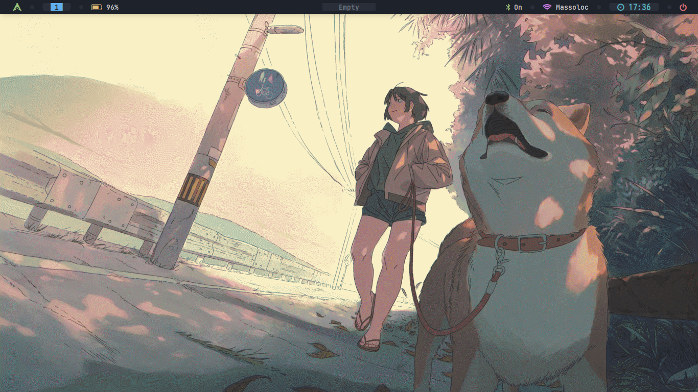

# Dotfiles

## Screenshots



## Dépendances

- alacritty (OpenGL terminal emulator)
- betterlockscreen (lock screen)
- btop (interactive process viewer)
- calcurse (terminal-based organizer)
- dunst (notificaiton-daemon)
- geany (small and lightweight IDE)
- hyprland (Dynamic tiling Wayland compositor)
- i3 (dynamic tiling window manager)
- neofetch (CLI system information tool)
- nvim (text editor)
- ranger (cli visual file manager)
- rofi (X11 pop-up window manager)
- Thunar (File Manager for the Xfce Desktop Environment)
- viewnior (simple & fast image viewer)
- zathura (document viewer)
- zsh (UNIX command interpreter (shell))
- stow (symlink farmer manager)

### Installation des dépendances

- pacman (Arch)

```sh
sudo pacman -Syy alacritty betterlockscreen btop calcurse dunst geany hyprland i3 neofetch nvim ranger rofi Thunar viewnior zathura zsh stow
```

- apt (debian)

```sh
sudo apt update
sudo apt install alacritty betterlockscreen btop calcurse dunst geany hyprland i3 neofetch nvim ranger rofi Thunar viewnior zathura zsh stow
```

### Contexte - Préambule (tldr)

Arborescence du projet :

dotfiles/  
├── config  
│   ├── dot-config  
│   ├── dot-fehbg  
│   ├── dot-oh-my-zsh  
│   └── dot-zshrc -> dot-config/zsh/zshrc  
├── README.md  
├── scripts  
│   ├── change_background.sh  
│   └── stow.sh  
└── wallpaper  
├── aesthetic-wallpapers  
├── chosen_background  
└── walls

Le principe est le suivant : dans le home il existe des fichier (souvent) cachés comme .config ou .bashrc. Ces fichiers sont des fichiers de configuration pour des applications comme i3, bash, nvim. Seulements il en existe beaucoup et ils peuvent être à différents endroit ce qui ne permet pas de faire du versionning sur nos fichiers de configuration. Ainsi si une de vos config ne fonctionne plus il faut donc aller mettre les mains dans le camboui et chercher des fichiers de conf et ça peut être fastidieux.

D'où l'utilité de mon repo, qui va creer des liens symboliques dans les endroits qu'il faut qui vont pointer sur les fichiers correspondant qui sont dans mon repo et permet donc de faire du versionning sur un repo unique.
On utilise [stow](https://www.gnu.org/software/stow/manual/stow.html) qui est un "symlink farm manager" qui permet de creer des symlink entre les fichiers de configuration dans les dossiers usuels du type .config/ .zshrc.

> On remarque que des fichiers ont pour nom "dot-...", c'est car stow va remplacer le "dot-" en "." au moment de creer des lien symboliques (ça permet de na pas se balader entre des fichiers cachés).

## installation

> [!WARNING]
> Si vous avez deja des fichiers de configuration (.zshrc, .config/nvim etc), je vous conseille de les renommer (en .zshrc.old par ex). Car on va creer des liens symboliques avec le meme nom au meme endroit.
> Il faut se mettre à la racine du repo et lancer le script stow.sh. (Vous pouvez aussi tout aussi bien copier les conf sans lancer le script)

```sh
cd dotfiles/
./scripts/stow.sh
WARNING: in simulation mode so not modifying filesystem.
Continue? (Y/N):
```

Dans l'idée tout est bon :thumbsup:

## Changer l'arrière plan du bureau

Le background qui est choisi pour le bureau est celui vers lequel pointe le lien symbolique ./wallpaper/chosen_background. Ainsi pour le changer il suffi de changer la cible du lien (sans changer le nom). Pour vous faciliter la vie j'ai fait un script ./scripts/change_background.sh :

```sh
./scripts/change_background.sh path_of_wallpaper_u_want
```
